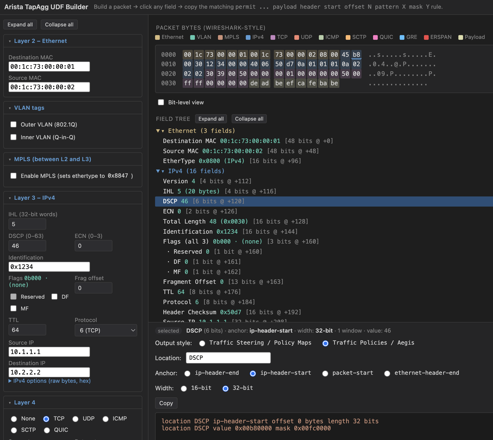

# Arista TapAgg UDF Builder

A single-file, self-hosted webpage for crafting Arista TapAgg User Defined Field
(UDF) match rules by clicking on packet fields — Wireshark-style. Supports both
the classic Traffic Steering / Policy Maps syntax and the newer Traffic Policies
(Aegis) syntax.



*Above: a TCP-over-IPv4 packet with the **DSCP** field selected and the
**Traffic Policies / Aegis** output style enabled. The hex pane shows the
bytes colour-coded by layer (Ethernet → IPv4 → TCP → Payload), the
matching field is lit up in the field tree, and the generated rule lands
at the bottom:*

```
location DSCP ip-header-start offset 0 bytes length 32 bits
location DSCP value 0x00b80000 mask 0x00fc0000
```

*The **Location** input auto-fills with the selected field's name; type
your own to override. **Copy** puts the generated lines on the clipboard.
Flip the **Output style** radio back to **Traffic Steering / Policy Maps**
to get the classic `payload header end offset N pattern X mask Y` form
instead.*

## Run it

Just open `index.html` in any modern browser, or serve the folder statically:

```sh
cd tapagg-udf
python3 -m http.server 8080
# then visit http://localhost:8080
```

No build step, no dependencies, no network.

## Building the packet

The left pane lets you assemble the packet from the outside in:

- **Ethernet** with optional 802.1Q or Q-in-Q VLAN tags
- **MPLS** label stack — 1 to 6 labels, each with Label / TC / TTL; the S bit
  is auto-set on the last label
- **IPv4** with header options; Total Length and header checksum are
  auto-computed as you edit
- One of:
  - **TCP** with full flag controls (NS through FIN), Data Offset, Window, Urgent
  - **UDP**
  - **ICMP** with auto-populated Type/Code dropdown
  - **SCTP** with src/dst port, Verification Tag, and Checksum
  - **QUIC** (over UDP) with long/short header form, first byte, version,
    Destination/Source Connection IDs and Packet Number
  - **GRE** (plain) with configurable Protocol Type and C/K/S flags
  - **ERSPAN** Type II / Type III over GRE — auto-forces IP Protocol 47,
    hides the L4 controls, and exposes an inner-frame builder so you can
    construct the captured frame as its own Ethernet/VLAN/IPv4/TCP/UDP/payload

The hex pane shows the resulting bytes coloured by layer. The same accent
colour is used in the legend swatch, the hex byte tint, and the field-tree
group header so it's easy to see what belongs where.

## Selecting fields

Three ways to pick what to match:

- Click a field name in the **field tree** — selects the entire field
- Click bytes in the **hex pane** — selects whole bytes
- Toggle **Bit-level view** to click individual bits

Selection modifiers:

- **Plain click** — replace the selection
- **Shift-click** — extend a contiguous range from the previous click
- **⌘ / Ctrl-click** — toggle (add or remove a *separate* block)
- **Clear selection** — empty everything

## Output styles

Two output styles cover the two flavours of UDF matching in Arista EOS.

### Traffic Steering / Policy Maps (default)

The classic ACL syntax. Each click produces a line like:

```
[sequence] [permit | deny] [protocol] [source] [destination] payload header end offset 0 pattern 0x45b80000 mask 0x0000ffff
```

- The `offset` is in **4-byte words**, measured either from the **start** or
  the **end** of the IP header (the *Header keyword* radios).
- On Arista, GRE is parsed as part of the IP header chain, so
  `header end offset 0` lands on the first word **after** the GRE header when
  GRE or ERSPAN is on the wire.
- `pattern` and `mask` are 32-bit, MSB-aligned. The `mask` is a reverse
  wildcard mask: **1 = ignore, 0 = care**.
- If your selection spans more than 4 bytes, multiple rules are emitted —
  all of them must match.

### Traffic Policies / Aegis

The newer EOS Traffic Policy match syntax. Each window produces two lines:

```
location DSCP ip-header-start offset 1 bytes length 16 bits
location DSCP value 0xb800 mask 0xfc00
```

- The **Location** input names the match-field. It defaults to
  `<location-name>` and auto-fills with the name of whatever single field
  you've selected (`DSCP`, `TCP-Src-Port`, …). Type your own and it sticks;
  clear it back to the placeholder and auto-naming resumes.
- The **Anchor** radio picks the reference point. Four options:
  - `ip-header-end` — first byte after the IP (+ GRE, on Arista) header
  - `ip-header-start` — first byte of the IPv4 header
  - `packet-start` — byte 0 of the packet
  - `ethernet-header-end` — first byte after the 14-byte Ethernet header
    (so VLAN/MPLS tags still contribute to the offset of any IP-or-later field)
- The **Width** radio chooses 16-bit or 32-bit match windows.
- `offset` is a count of **width-sized chunks** from the anchor — i.e. each
  unit is 2 bytes at 16-bit width or 4 bytes at 32-bit width. So matching
  the TCP SYN flag (byte 13 of the TCP header, i.e. 13 bytes past
  `ip-header-end`) at 16-bit width snaps to byte 12 and emits `offset 6`.
- The window must be aligned to the chosen width relative to the anchor;
  the builder snaps the window *down* from the first selected byte so the
  selection is always covered.
- The parser caps coverage at **128 bytes** from the anchor. Windows that
  would exceed that are dropped with a warning, as are windows that fall
  before the anchor.
- `value` and `mask` use Aegis semantics: the `mask` enables matching —
  **1 = match this bit, 0 = don't care**. (Opposite of the steering wildcard.)

## Copying

Hit **Copy** to put the generated rule(s) on your clipboard. For Steering
output the dimmed ACL prefix is stripped; for Aegis the full `location …`
lines are copied verbatim.
